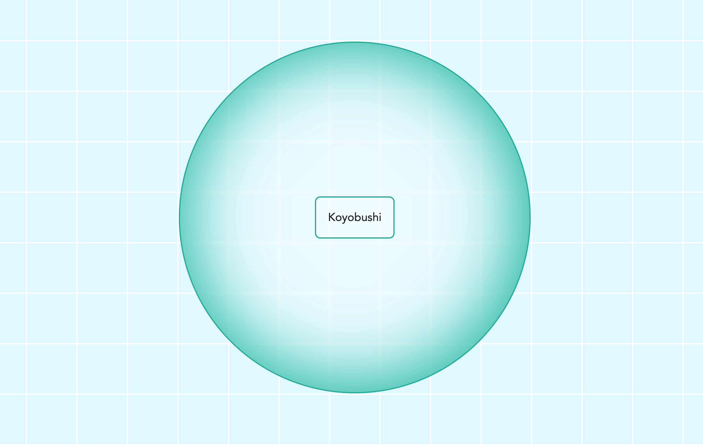

# Koyobushi


A clean, playful atmospheric TypeScript + Tailwind + Vite demo with a subtle Japanese-inspired glow.
This small project creates an interactive button. On odd clicks, the surrounding wrapper transforms into a soft circular balloon with an inner glow. On even clicks, everything resets to a crisp, modern rectangular look.

## Overview

Click away and enjoy the subtle shift between sharp modernity and soft, glowing serenity.
Simple, satisfying, and just a little bit Japanese. Enyjoy “Koyobushi” (小夜節).




## Project Structure

```
koyobushi/
├── index.html
├── vite.config.ts
├── package.json
├── tsconfig.json (standard Vite TS config works)
├── src/
│   (optional folder, used here for clarity)
│   ├── main.ts
│   └── input.css   ← Tailwind base
└── dist/       ← generated on build

```

## License

This project is private and intended for demonstration or personal use. See package.json for details.

## Contact

Maintained by tpreisig - feel free to reach out!
