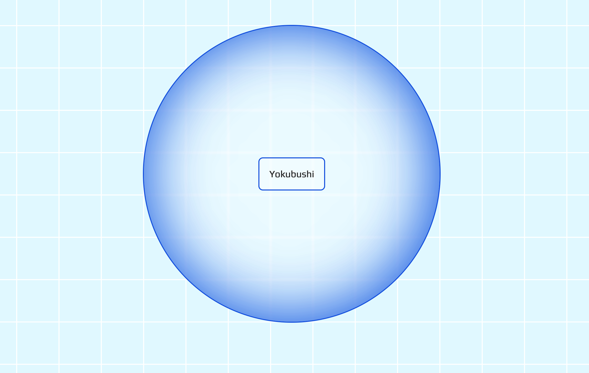

# Yokobushi


A clean, playful TypeScript experiment with a subtle Japanese-inspired glow.
This small project creates an interactive button. On odd clicks, the surrounding wrapper transforms into a soft circular "lantern" or balloon with an inner glow. On even clicks, everything resets to a crisp, modern rectangular look.

## Overview

Click away and enjoy the subtle shift between sharp modernity and soft, glowing serenity.
Simple, satisfying, and just a little bit Japanese. Dōzoお楽しみください! 🙏




## Project Structure

```
project-root/
├── index.html
├── src/
│   └── main.ts          # Paste the provided code here
├── dist/                # Output from tsc
└── tsconfig.json        # Provided config below

```

## License

This project is private and intended for demonstration or personal use. See package.json for details.

## Contact

Maintained by tpreisig - feel free to reach out!
